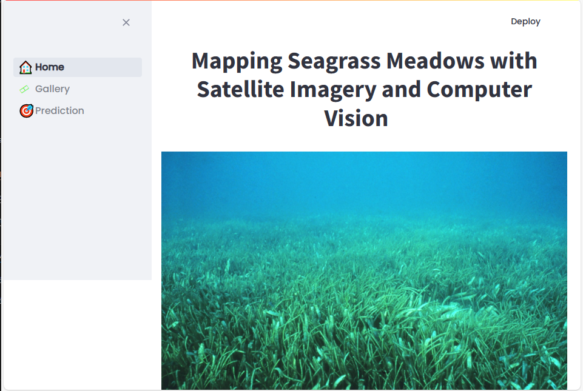
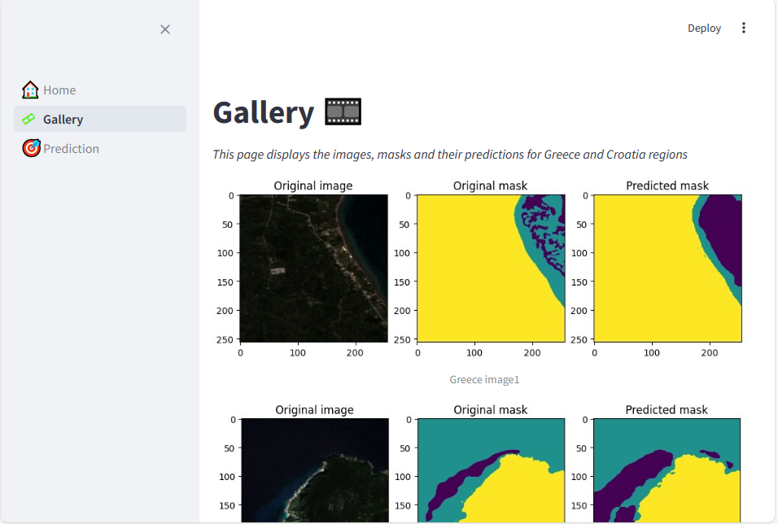
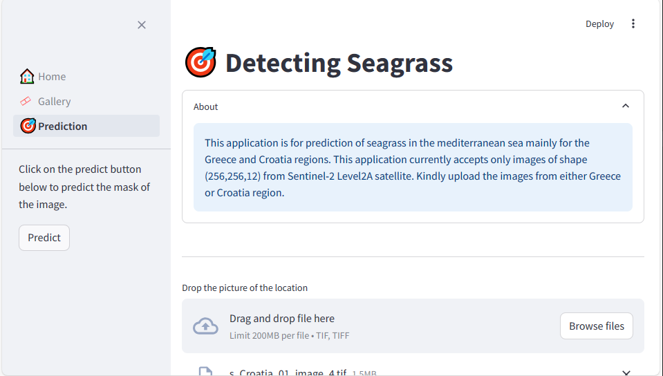

## Streamlit Seagrass Prediction App

This application uses Streamlit to predict the seagrass mask from an uploaded image.

**Requirements:**

* Python 3.6+
* keras==3.3.3
* numpy==1.26.4
* scipy==1.13.1
* matplotlib==3.9.0
* streamlit==1.35.0
* tensorflow==2.16.1
* tifffile==2024.5.22
* opencv-python==4.9.0.80

**Installation:**

1. Clone this repository.
2. Create a virtual environment:
    ```bash
    python -m venv venv
    source venv/bin/activate
    ```
3. Install required dependencies:
    ```bash
    pip install -r requirements.txt
    ```

## Instructions to build a Docker image and container

**Create the Image**
```
docker build -t omdena_app .
```

**Create the Container**
```
docker run -p 8501:8501 omdena_app
```

Go to ```http://localhost:8501/``` and visualize the app:

## **Running the App:**

1. Open the project in your preferred IDE (e.g., VS Code).
2. Start the Streamlit app:
    ```bash
    streamlit run app.py
    ```
3. Access the app in your web browser: http://localhost:8501

**Instructions:**

1. Upload an image containing a seagrass scene.
2. Click the "Predict" button.
3. The predicted seagrass mask will be displayed alongside the original image.

## **Contributing:**

We welcome contributions to this project. Please submit pull requests with proper documentation and testing.

## **License:**

This project is licensed under the MIT License. See the LICENSE file for details.

## **Contact:**

For any questions or feedback, please contact [your email address or contact information].

## Link to the streamlit application

The application has been deployed on Streamlit community cloud. 
Link ---> 

## Screenshots from the application



